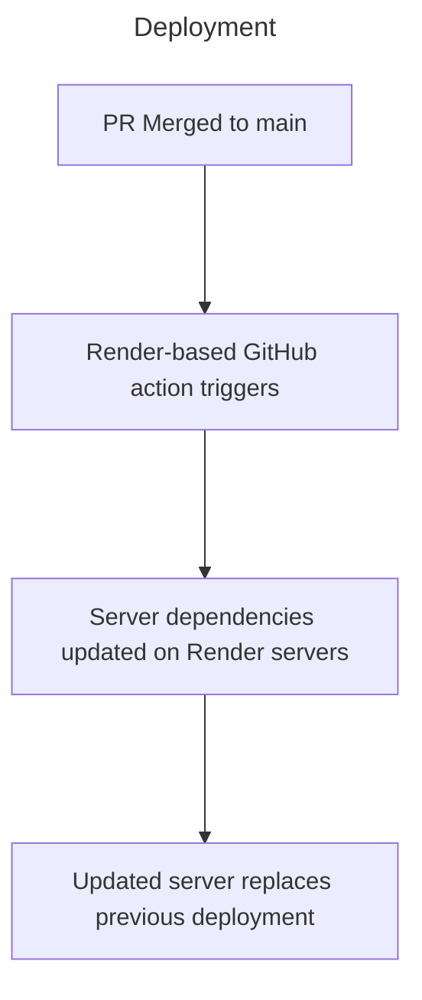

## Architecture Diagram

![[new-high-level-arch.pdf]]

## Summary and Justification

### Frontend

We're using *React Native* with the *Expo Framework* (in *Typescript*) as they offer a well-tested and flexible cross platform UI development experience.

See [[DR03 - Frontend Framework]] and [[DR04 - Frontend Language]] for more information.

### Backend

We're using the *Bun* runtime and framework (with *Typescript*) for our backend as they are fast, modern, easy to pickup and develop secure applications with, and widely supported.

See [[DR05 - Backend Language]] for more information.

### Database

Our main database is *PostgreSQL* as it's an extremely popular and modern choice for building reliable and performant applications with data storage needs.

See [[DR08 - Database]] for more information.

### Hosting Provider

We are using *Render*'s hosting platform, as it offers a simple and friendly abstraction over AWS without removing too much flexibility regarding server architecture - providing the best of both worlds in simplicity, price, scalability, and flexibility.

See [[DR06 - Deployment]] for more information.

#### Deployment

The deployment process for our application is a simple automated sequence based on the principles of CI/CD.

The hosting provider *Render* uses AWS's infrastructure behind-the-scenes to enable pre-configured builds and deployment triggered by GitHub actions. As a result, our entire deployment process follows these steps:

#### Handling Production Bugs
Typically the most likely time to encounter bugs is during the rollout of a new deployment. We can mitigate the likelihood of this, as well as the impact of it should it still happen through 2 key properties of our development and deployment plans:
- `main` must always be stable and thoroughly tested locally. Any PRs must be approved by the entire team
- Render permits quick rollbacks to previous deployments, allowing us to quickly address the issue using our `hotfix` development branch - before we push the new (stabilised) version to `main` (and thus, production)

