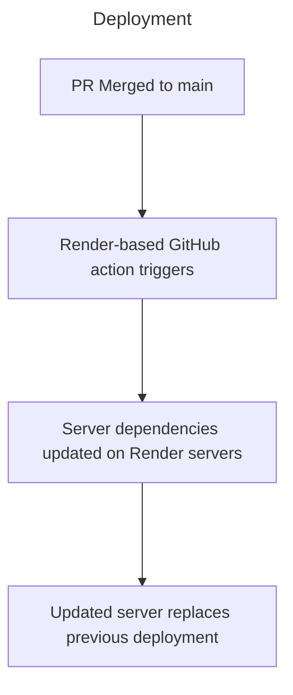

The deployment process for our application is a simple automated sequence based on the principles of CI/CD.

The hosting provider *Render* uses AWS's infrastructure behind-the-scenes to enable pre-configured builds and deployment triggered by GitHub actions. As a result, our entire deployment process follows these steps:

>[!Info]
> Render's official documentation on automated deployment can be found at: https://render.com/docs/deploys

#### Handling Production Bugs

Typically the most likely time to encounter bugs is during the rollout of a new deployment. We can mitigate the likelihood of this, as well as the impact of it should it still happen through 2 key properties of our development and deployment plans:
- `main` must always be stable and thoroughly tested locally. Any PRs must be approved by the entire team
- Render permits quick rollbacks to previous deployments, allowing us to quickly address the issue using our `hotfix` development branch - before we push the new (stabilised) version to `main` (and thus, production)

